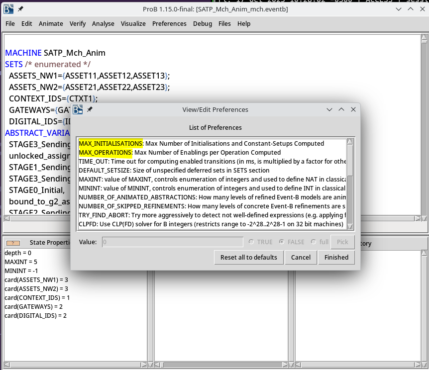

---
title: Modelando propiedades de liveness en Event-B
author: Ramiro Garay
date: Agosto, 2025
theme: simple
...

# Antes de empezar...

## Sobre mí

::::::: {.columns}

:::: {.column width="25%"}


::::

:::: {.column width="75%"}

::: incremental

* Argentino, ex-estudiante de Ingeniería en Informática de la UNL, Santa Fe (2017-2022)
* Desarrollador a medio tiempo para MLabs, una consultora especializada en Blockchain (2022-)
* Estudiante avanzado de Licenciatura en Computación (2025-)
* Actualmente becario PREXI en el LINS

:::

::::

:::::::

## Agenda

::: notes

Objetivos:
  1. Aprender que son las props de liveness y por qué importan
  2. Como formalizar esto en una lenguaje formal (LTL))
  3. como formalizar propiedades de liveness en Event-B (que es mas que nada safety)
     3.1. Que se puede demostrar facilmente? Convergencia.
     3.2. Como demostrar cosas mas complejas (existencia, persistencia, etc).
     3.3. Desventajas y ventajas de utilizar SOLO event-b para liveness.
     3.4. Posibles soluciones (Meta-theory para hablar de trazas)
  4. Intro a model checking y verificacion de propiedades LTL con ProB
     4.1
     4.1. Espacio de estados
     4.2. Checkeos exhaustivos vs. no exhaustivos
  5. Bibliografía
     
Ejemplo: PingPong? 

:::

::: incremental

1. Intro. propiedades de liveness
2. _Lógica Temporal Lineal (LTL)_
3. **Demostración** de propiedades de liveness (sólo existencia)
4. **Verificación** de propiedades de liveness usando _model checking_

:::

# Propiedades de Liveness (Intro)

## Una definición informal

"Son aquellas propiedades que nos garantizan que el sistema eventualmente va a
hacer **algo**"

. . .

Son fundamentales, ya que permiten representar ciertos comportamientos dinámicos
del sistema.

## Ejemplo: ascensor (I)

Un ascensor debe cumplir propiedades de safety. Por ejemplo:

:::::: {.columns}
:::: {.column width="30%"}

::::
:::: {.column width="70%"}
::: incremental
* El ascensor **nunca** se mueve con la puerta abierta
* El ascensor **nunca** cierra la puerta cuando un usuario es detectado en el umbral
:::
::::
::::::

## Ejemplo: ascensor (II)

Pero también de liveness!

:::::: {.columns}
:::: {.column width="30%"}

::::
:::: {.column width="70%"}
::: incremental
* Si el usuario pide el ascensor, **eventualmente** el mismo viaja hacia
  el piso del usuario.
* Si el usuario seleccionó un piso, **eventualmente** el ascensor va
  a llegar al piso pedido.
:::
::::
::::::

## Ejemplo: ascensor (III)

Un ascensor sin propiedades de liveness puede ser muy seguro, pero también **inútil**.

. . . 

_Ejemplo_: Un ascensor que se mantiene cerrado e inmóvil satisface todas las
propiedades de safety pero **ninguna**  de liveness.

## "Completitud" de propiedades de _safety_ y _liveness_

::: notes

NOTA IMPORTANTE:

Una característica de las propiedades de safety es que, una vez violadas,
son irremediables (ej: una vez que el ascensor cerró la puerta con un usuario entrando,
es más que suficiente para decir que es inseguro).

Las propiedades de liveness, en cambio, no. Porque solo aseguran que algo ocurrirá
eventualmente (ej: un ascensor puede tardar mucho en venir, pero siempre que eventualmente
lo haga, va a satisfacer la propiedad de liveness).

Pregunta: ¿como logramos que el ascensor venga siempre, pero con un limite de tiempo?
RTA: Safety + Liveness

:::

::: incremental

* Usando propiedades de safety y liveness, uno puede especificar **completamente**
  un sistema. [^1]

* O al revés: toda propiedad es de safety, liveness o una combinación de ambas.

:::

## Ejemplos de propiedades de liveness

::: notes

Algunos ejemplos reales y relevantes para computación distribuida.

:::

::: incremental

1. _Starvation freedom_: un proceso hace progreso infinitamente seguido
2. _Termination_: el proceso finaliza
3. _Guaranteed service_: cada solicitud es satisfecha eventualmente

:::

# Un poco de LTL

## Hacia una definición formal

Para definir formalmente propiedades de liveness es necesario hablar de _tiempo_.

. . .

La Lógica Temporal Lineal (LTL) es una extensión de la _lógica de 1er orden_
que incluye **operadores temporales**.

::: notes

Por lo tanto, una fórmula LTL se ve muy parecida a una fórmula lógica de 1er orden:
con las conectivas lógicas que ya conocemos (AND, OR, NOT, etc.) y variables lógicas
que pueden ser TRUE o FALSE.

:::

. . .

Los operadores temporales de LTL nos permite expresar cosas como **siempre**,
**después**, **eventualmente**, etc.

## Hacia una definición formal

Al igual que la lógica de 1er orden, LTL se puede analizar desde dos puntos de vista:

. . .

::: incremental

1. La _sintaxis_ (cómo se construyen las fórmulas lógicas)
2. La _semántica_ (cuándo se satisfacen las fórmulas)

:::

. . .

Empezamos por la semántica.

::: notes

Recordemos que en lógica de 1er orden, una fórmula con variables es satisfecha
por una _asignación_ de variables particular.

:::

## Estructura de Kripke

La semántica de LTL requiere de una estructura auxiliar llamada  **estructura de Kripke**.

:::::: {.columns}
:::: {.column width="50%"}

::::
:::: {.column width="50%"}

::::
::::::

⇒ Donde $p(s)$ y $q(s)$ son predicados definidos sobre el estado de la máquina

::: notes

Una estructura de Kripke es una máquina de estados enriquecida con proposiciones
lógicas (de 1er orden!).

En cada estado de la máquina tenemos en rojo _cuáles_ proposiciones son verdaderas.

Nótese que esta máquina de estados puede modelarse en Event-B fácilmente (¿cómo?)

:::

## Traza de una máquina

Una máquina de estados tiene asociada un conjunto de **trazas**.

Una traza es una sucesión (posiblemente infinita!) de estados. Estos
se obtienen de ejecutar la máquina **respetando las restricciones**.

. . .

:::::: {.columns}
::::: {.column width="50%"}

:::::
::::: {.column width="50%"}
::: incremental
* $\Omega = s_1, s_2, s_1, s_2, s_1, s_2 ...$
* $\Gamma = s_1, s_2, s_1, s_2, s_3$
:::
:::::
::::::

* * *

¿Qué restricciones? En Event-B:

1. Invariantes del modelo
2. Pre- y post-condiciones de cada evento

:::::: {.columns}
::::: {.column width="50%"}

:::::
::::: {.column width="50%"}

:::::
::::::

::: notes

¿Qué restricciones? Todas las que queramos. En el caso de Event-B: las invariantes
que definamos, las pre-condiciones y post-condiciones de las transiciones, teoremas, etc.

:::

## Traza de una máquina

Por lo tanto, la estructura de Kripke también tiene una traza.

:::::: {.columns}
::::: {.column width="50%"}

:::::
::::: {.column width="50%"}
::: incremental
* Pero además podemos hablar de **cómo las proposiciones de nuestra estructura cambian con el tiempo.**
* Trazas:
    + $\Omega = s_1, s_2, s_1, s_2, s_1, s_2 ...$
    + $\Gamma = s_1, s_2, s_1, s_2, s_3$
* "Palabras":
    + $w_1 = \lbrace p \rbrace, \lbrace q \rbrace, \lbrace p \rbrace, \lbrace q \rbrace, \lbrace p \rbrace, \lbrace q \rbrace ...$
    + $w_2 = \lbrace p \rbrace, \lbrace q \rbrace, \lbrace p \rbrace, \lbrace q \rbrace, \lbrace p, q \rbrace$
* Esto es muy **potente**.
:::
:::::
::::::

## Fórmulas lógicas y su semántica

Ahora que conocemos las estructuras de Kripke, podemos ver cómo
se definen fórmulas LTL en base a ellas.

. . .

Lo haremos por medio de ejemplos

## LTL: Ejemplos (1)

La traza de una estructura de Kripke pueden satisfacer o no **una fórmula LTL**
$$(\Omega \vdash \phi)$$

. . .

Empezamos con la traza:

$$ \Omega = s_1, s_2, s_1, s_2, s_1, s_2 ... $$

## LTL: Ejemplos (1)

:::::: {.columns}
::::: {.column width="50%"}

$$ \Omega = s_1, s_2, s_1, s_2, s_1, s_2 ... $$
:::::
::::: {.column width="50%"}

::: incremental
* _Variables lógicas / proposiciones con conectivas lógicas_
  * $$ \Omega \vdash p $$
  * $$ \Omega \vdash \lnot q $$
* _**Operadores temporales**_
  * "Siguiente": $$ \Omega \vdash \circ q $$
  * "Siempre": $$ \Omega \vdash \square (p \lor q) $$ 
  * ...
:::

::: notes

Aclarar que cualquier fórmula lógica puede ir a la derecha. Sin operadores temporales,
la misma debe ser cierta solo en el primer estado del camino.

:::

:::::
::::::

## LTL: Ejemplos (2)

Otro ejemplo (**finito**):


:::::: {.columns}
::::: {.column width="50%"}

$$ \Gamma = s_1, s_2, s_1, s_2, s_3 $$
:::::
::::: {.column width="50%"}

$\Gamma$ satisface las mismas propiedades que antes, pero también:

* "Eventualmente": $$ \Gamma \vdash \lozenge (p \land q) $$

:::::
::::::

## Observaciones

Todas las propiedades de liveness se pueden expresar usando fórmulas LTL

. . .

Cuando queremos probar liveness para un modelo de Event-B, nos interesa que **todas** las
trazas de una máquina cumplan con una propiedad de liveness.

. . .

Si una propiedad de liveness no se cumple, siempre debe existir una traza
que sirva de contraejemplo.

::: notes

Esto último también es cierto para propiedades de safety. La diferencia es que
en las propiedades de safety, el contraejemplo es siempre finito y puede ser
simplemente un prefijo de la traza de ejecución completa.

:::

# Propiedades de Liveness (en LTL)

## Intro al modelo PingPong

Ahora que conocemos lo necesario de LTL, podemos ver algunas propiedades
de liveness y como se expresan lógicamente.

. . .

Usaremos como ejemplo el modelo `PingPong`

* * *


::: notes

Es un modelo artificial que nos sirve para estudiar algunas propiedades
interesantes.

Es un sistema que oscila y que nunca termina.

:::

* * *

(Mostrar modelo en Rodin)

::: notes

Explicar cuales son las variables del modelo y cuales son los eventos.

:::

## Existencia de $P$ (definición)


"_**Siempre** es cierto que, **eventualmente** P es verdadero_"

. . .

En LTL:

$\square \lozenge P$

## Existencia de $P$ (ejemplos)

:::::: {.columns}
:::: {.column width="50%"}

::::
:::: {.column width="50%"}

Ejemplos:

* $\square \lozenge (is\_pinging = 0)$
* $\square \lozenge (is\_pinging = 1)$

Estas propiedades nos dicen que algunos estados están garantizados que van
a ocurrir, independientemente de la traza particular.

Pueden ser útiles para demostrar la disponibilidad de un servicio:

> "Siempre es cierto que, eventualmente, el sistema está listo para recibir nuevas solicitudes"

::::
::::::


## Existencia de $P$ (demostración)

Por medio de dos propiedades auxiliares [^2]:

1. **Convergencia en $\lnot P$**
2. **$\lnot P$ es libre de deadlocks**

. . .


. . .

Intuición:

1. $\lnot P$ debe transicionar a otro estado eventualmente, sino $P$ sería imposible.
2. $\lnot P$ debe ser deadlock-free, o de otra forma sería imposible que $P$ sea cierto.

* * *

(Mostrar demostracion en Rodin)

## Persistencia de $P$ (definición)


"_**Eventualmente** es cierto que, **siempre** P es verdadero_"

. . .

En LTL:

$\lozenge \square P$

## Persistencia de $P$ (demostración)

Por medio de dos propiedades auxiliares [^2]:

1. **Divergencia en $P$**
2. **$\lnot P$ es libre de deadlocks**

. . .


. . .

Intuición:

1. Para que $P$ sea persistente, debe ser cierto que $P$ lleva a $P$ siempre.
2. $P$ debe ser libre de deadlocks, o de otra forma no puede llevar a sí mismo.

## Persistencia de $P$ (ejemplo)

El modelo PingPong original no tiene persistencia de ningún tipo (oscila siempre entre
los estados Ping y Pong).

* * *

Pero un modelo con un estado final *sí* tiene persistencia. Este es `PingPongEnd`.


* * *

Ejemplo de traza (generada con ProB):


* * *

:::::: {.columns}
:::: {.column width="50%"}

::::
:::: {.column width="50%"}

Ejemplos ($RUN\_LIMIT = 2$):

* $\lozenge \square (runs\_counter = RUN\_LIMIT)$

Estas propiedades nos dicen que algunos estados están garantizados que van
a ocurrir, independientemente de la traza particular.

Pueden ser útiles para demostrar la disponibilidad de un servicio:

> "Siempre es cierto que, eventualmente, el sistema está listo para recibir nuevas solicitudes"

::::
::::::

* * *

(Mostrar en Rodin)

## Progreso de $P_1$ a $P_2$ (Definición)

"_**Siempre** es cierto que, si $P_1$ es verdadero, **eventualmente** $P_2$ lo va a ser_"

. . .

En LTL:

$\square (P_1 \implies \lozenge P_2)$

## Progreso de $P_1$ a $P_2$ (Demostración)

Por medio de varias propiedades auxiliares (no tan simples).

:::::: {.columns}
:::: {.column width="50%"}

::::
:::: {.column width="50%"}

::::
::::::

. . .

(Omitimos explicación - consultar [^2])

. . .

# Propiedades auxiliares

## Convergencia de un evento (I)

Esta propiedad de liveness **sí** se puede representar en el lenguaje de Event-B.

_"Si un evento convergente está activado, entonces eventualmente va a dejar de estarlo"_

Para marcar un evento como convergente, se lo marca con la  palabra clave `convergent`.

Adicionalmente, al modelo se le debe agregar una _variante_.

## Convergencia de un evento (II)

La variante es un número que satisface las siguientes condiciones:

1. Cuando el evento está activo, **la variante es un número natural**.
2. Cuando el evento se ejecuta, **la variante disminuye**.

. . .

Intuitivamente, esto implica que cuando la variante deje de ser natural, el evento
**ya no va a estar activo** (_Modus tollens_ en proposición 1).

. . .

Así mísmo, la variantes **debe** dejar de ser natural, ya que el evento disminuye
la variante con cada ejecución.

## Convergencia de un evento (III)

Cuando varios eventos son convergentes, la elección de la variante se complica.

¿Por qué? Porque Event-B permite **solo una variante por modelo**.

La solución para este problema es combinar las variantes de cada evento convergente
en una única _variante lexicográfica_.

. . .

(TODO: mostrar Variante en modelo PingPongEnd)

## Convergencia en P

TODO

## Divergencia

TODO

## Transiciona de $P_1$ a $P_2$

TODO

# Verificación en ProB

## "Model check" (I)

Esta funcionalidad explora lo máximo posible el espacio de estados del modelo para
encontrar _violaciones de invariantes/teoremas_ y _deadlocks_.

Es útil para verificar que el modelo cumple con las variantes **antes de demostrarlo**.

(TODO: Mostrar espacio de estados generado por ProB)

## "Model check" (II)

Hay dos casos donde el model check no es exhaustivo:

* **No se exploró el espacio de estados completo**
* **No se exploraron todos los eventos posibles**

Ambos se pueden remediar aumentando los valores de las constantes `MAX_INITIALIZATIONS`
y `MAX_OPERATIONS` y **acotando las constantes del modelo** (fundamental).



## "Model check" (III)

El _model checking_ nos permite **sólo verificar**, no demostrar.

En el mejor de los casos (cuando el chequeo es exhaustivo), nos permite **demostrar**
las propiedades deseadas en un modelo más pequeño que el "real".

## LTL checking (I)

Esta funcionalidad nos permite escribir fórmulas LTL que son verificadas por ProB.

ProB soporta todos los operadores temporales e incluso algunos operadores específico
a B/Event-B que facilitan la escritura de propiedades útiles.

## LTL checking (II)

Las propiedades de liveness se pueden escribir del siguiente modo:

```
G F ({is_pinging = 1}))
G F ({is_pinging = 0}))
F G ({runs_counter = RUNS_LIMIT})
G (e(ping) => F (e(pong)))
```

Donde `e(<evento>)` es la _guarda del evento en cuestión_ (i.e: el evento está activado).

# Bibliografía

## Bibliografía

[^1]: B. Alpern y F. B. Schneider, «Defining liveness», Information Processing Letters, vol. 21, n.º 4, pp. 181-185, oct. 1985, doi: 10.1016/0020-0190(85)90056-0.
[^2]: T. S. Hoang y J.-R. Abrial, «Reasoning about Liveness Properties in Event-B», en Formal Methods and Software Engineering, vol. 6991, S. Qin y Z. Qiu, Eds., en Lecture Notes in Computer Science, vol. 6991. , Berlin, Heidelberg: Springer Berlin Heidelberg, 2011, pp. 456-471. doi: 10.1007/978-3-642-24559-6_31.

