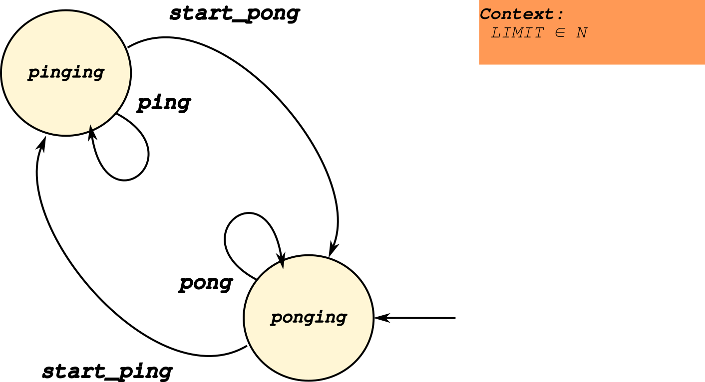
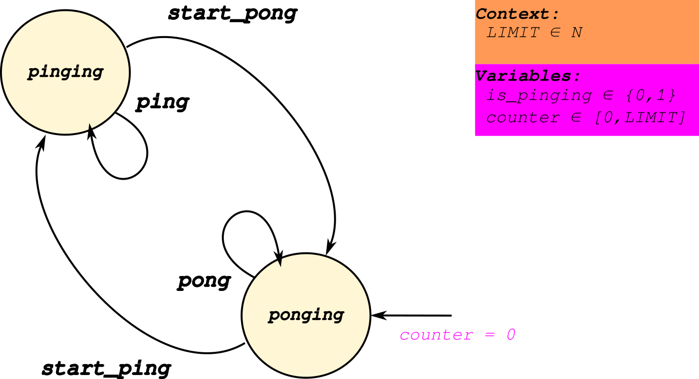
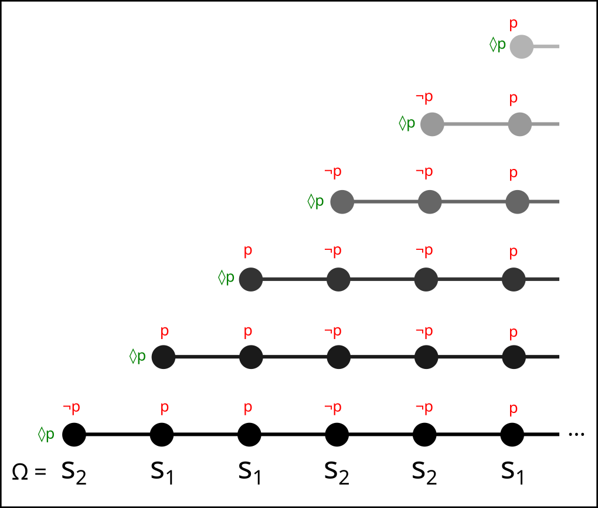
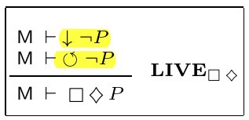

---
title: Modelando propiedades de liveness en Event-B
author: Ramiro Garay
date: Octubre, 2025
theme: simple
...

# Antes de empezar...

## Sobre mí

::::::: {.columns}

:::: {.column width="25%"}


::::

:::: {.column width="75%"}

::: incremental

* Argentino, ex-estudiante de Ingeniería en Informática de la UNL, Santa Fe (2017-2022)
* Desarrollador a medio tiempo para MLabs, una consultora especializada en Blockchain (2022-)
* Estudiante avanzado de Licenciatura en Computación (2025-)
* Actualmente becario PREXI en el LINS

:::

::::

:::::::

## Agenda

::: incremental

1. Introducción a propiedades de liveness
2. Introducción al modelo `PingPong`
3. Formalizacion de una propiedad de liveness
4. **Verificación** de propiedades de liveness usando _model checking_

:::

# Propiedades de Liveness (Intro)

## Una definición informal

"Son aquellas propiedades que nos garantizan que el sistema eventualmente va a
hacer **algo**"

. . .

Son fundamentales, ya que permiten representar ciertos comportamientos dinámicos
del sistema.

## Ejemplo: ascensor (I)

Un ascensor debe cumplir propiedades de safety. Por ejemplo:

:::::: {.columns}
:::: {.column width="30%"}

::::
:::: {.column width="70%"}
::: incremental
* El ascensor **nunca** se mueve con la puerta abierta
* El ascensor **nunca** cierra la puerta cuando un usuario es detectado en el umbral
:::
::::
::::::

## Ejemplo: ascensor (II)

Pero también de liveness!

:::::: {.columns}
:::: {.column width="30%"}

::::
:::: {.column width="70%"}
::: incremental
* Si el usuario pide el ascensor, **eventualmente** el mismo viaja hacia
  el piso del usuario.
* Si el usuario seleccionó un piso, **eventualmente** el ascensor va
  a llegar al piso pedido.
:::
::::
::::::

## Ejemplo: ascensor (III)

Un ascensor sin propiedades de liveness puede ser muy seguro, pero también **inútil**.

. . . 

_Ejemplo_: Un ascensor que se mantiene cerrado e inmóvil satisface todas las
propiedades de safety pero **ninguna**  de liveness.

## "Completitud" de propiedades de _safety_ y _liveness_

::: notes

NOTA IMPORTANTE:

Una característica de las propiedades de safety es que, una vez violadas,
son irremediables (ej: una vez que el ascensor cerró la puerta con un usuario entrando,
es más que suficiente para decir que es inseguro).

Las propiedades de liveness, en cambio, no. Porque solo aseguran que algo ocurrirá
eventualmente (ej: un ascensor puede tardar mucho en venir, pero siempre que eventualmente
lo haga, va a satisfacer la propiedad de liveness).

Pregunta: ¿como logramos que el ascensor venga siempre, pero con un limite de tiempo?
RTA: Safety + Liveness

:::

::: incremental

* Usando propiedades de safety y liveness, uno puede especificar **completamente**
  un sistema. [^1]

* O al revés: toda propiedad es de safety, liveness o una combinación de ambas.

:::

## Ejemplos de propiedades de liveness

::: notes

Algunos ejemplos reales y relevantes para computación distribuida.

:::

::: incremental

1. _Starvation freedom_: un proceso hace progreso infinitamente seguido
2. _Termination_: el proceso finaliza
3. _Guaranteed service_: cada solicitud es satisfecha eventualmente

:::

# Introducción al modelo `PingPong`

## Introducción

Ahora introducimos un modelo pequeño y sencillo para identificar algunas propiedades
de liveness y luego estudiarlas.

. . .

Este modelo oscila entre sólo dos estados, como en un partido de ping-pong, de ahí su nombre.

* * *



* * *

::::::: {.columns}
:::: {.column width="60%"}

::::
:::: {.column width="40%"}

Algunas propiedades del modelo

::: incremental

1. Su ejecución no termina en ningún momento
2. Su estado inicial es `ponging`
3. Está parametrizado por la constante `LIMIT`
4. El modelo hace `ping` (o `pong`) `LIMIT` veces y luego alterna.
    * (esto último se hace por medio de guardas y variables)
:::

::::
:::::::

## Especificación en Event-B (variables)



## Especificación en Event-B (pre- y post-condiciones)


## Identificamos una propiedad de liveness

Ahora que entendemos el modelo en detalle, observamos una propiedad
interesante:

> "**Siempre** ocurre que, **eventualmente**, el modelo se encuentra en el estado `pinging`"

. . .

Intuitivamente, esto es cierto porque el modelo **siempre** oscila entre dos estados,
de los cuales uno es el estado `pinging`.

. . .

Esta es una propiedad de _existencia_. Las siguientes preguntas son:

::: incremental

1. ¿cómo formalizamos esta propiedad?
2. ¿cómo **demostramos** esta propiedad para nuestro modelo? (spoiler: con esfuerzo!)
3. ¿cómo **verificamos** esta propiedad?

:::

# Hacia una definición formal de existencia

## Introducción a LTL

Para definir formalmente una propiedad de liveness es necesario hablar de _tiempo_.

. . .

Para este fin usamos lógica formal.

. . .

La Lógica Temporal Lineal (LTL) es una extensión de la _lógica de 1er orden_
que incluye **operadores temporales**.

::: notes

Por lo tanto, una fórmula LTL se ve muy parecida a una fórmula lógica de 1er orden:
con las conectivas lógicas que ya conocemos (AND, OR, NOT, etc.) y variables lógicas
que pueden ser TRUE o FALSE.

:::

. . .

Los operadores temporales de LTL nos permiten expresar cosas como **siempre**,
**después**, **eventualmente**, etc.

* * *

Al igual que la lógica de 1er orden, la LTL se puede analizar desde dos puntos de vista:

. . .

::: incremental

1. La _sintaxis_ (cómo se construyen las fórmulas lógicas)
2. La _semántica_ (cuándo se satisfacen las fórmulas)

:::

. . .

Empezamos por la semántica.

::: notes

Recordemos que en lógica de 1er orden, una fórmula con variables es satisfecha
por una _asignación_ de variables particular.

:::

## Estructura de Kripke del modelo PingPong

La semántica de LTL requiere de una estructura auxiliar llamada  **estructura de Kripke**.

. . .

La estructura de Kripke se obtiene de agregar fórmulas lógicas a una máquina de estado.

. . .

Veamos una estructura de Kripke para el modelo `PingPong`.

* * *


⇒ Definimos un conjunto de proposiciones y en base a _ellas_ definimos los estados de
  la máquina.

::: notes

Una estructura de Kripke es una máquina de estados enriquecida con proposiciones
lógicas (de 1er orden!).

En cada estado de la máquina tenemos en rojo _cuáles_ proposiciones son verdaderas.
:::

## Traza de una máquina

Con la estructura de Kripke, podemos empezar a analizar si ciertas fórmulas LTL son
verdaderas o no.

. . .

Se dice que una fórmula es válida si **todas** las _trazas_ de la estructura de Kripke satisfacen
la fórmula.

. . .

⇒ Una traza es una sucesión (posiblemente infinita!) de estados. Estos
se obtienen de ejecutar la máquina **respetando las restricciones**.


## Traza del modelo PingPong (`LIMIT = 2`)

:::::: {.columns}
::::: {.column width="80%"}

:::::
::::: {.column width="60%"}
::: incremental

Para cada valor de `LIMIT`, el modelo PingPong tiene una única traza posible. Por ejemplo:

* $\Omega = s_2, s_1, s_1, s_2, s_2, s_1, ...$

Asociado a cada estado de la traza, se encuentra el conjunto de proposiciones que
son verdaderas para ese estado:

* $w = \lbrace \lnot p, l \rbrace , \lbrace p, m \rbrace, \lbrace p, h \rbrace, \lbrace \lnot p, m \rbrace, ...$ 

(Esta sucesión se llama _palabra_)

:::
:::::
::::::

## Formulando existencia

Para formular nuestra propiedad de existencia, necesitamos dos operadores temporales.

::: incremental 

1. Siempre ($\square$)
2. Eventualmente ($\lozenge$)

:::

. . .

Con estos dos, podemos formular la propiedad que deseamos:

> "**Siempre** ocurre que, **eventualmente**, el modelo se encuentra en el estado `pinging`"

. . .

En LTL:

$$ \square (\lozenge p) $$

## Verificando la válidez de la fórmula (a mano)

Anteriormente calculamos la traza para `LIMIT = 2`:

* $\Omega = s_2, s_1, s_1, s_2, s_2, s_1, ...$

y su correpondiente palabra:

* $w = \lbrace \lnot p, l \rbrace , \lbrace p, m \rbrace, \lbrace p, h \rbrace, \lbrace \lnot p, m \rbrace, ...$ 

. . . 

¿Cómo podemos validar que la traza satisface la fórmula:

$$ \square (\lozenge p) $$

?

. . .

Porque:

1. $\square p$: se satisface si _p_ es satisfecho por todas las _subtrazas_.
2. $\lozenge p$: se satisface si _p_ es satisfecho por alguna _subtraza_.
3. $p$: se satisface si el primer elemento de la traza satisface _p_

* * *


* * *



* * *


## Otras fórmulas

El modelo también satisface otras fórmulas LTL:

* $\square (l \implies \lozenge h)$ (progreso de _l_ a _h_)
* $\square (h \implies \lozenge l)$ (progreso de _h_ a _l_)

Si incluimos un estado final (modelo PingPongEnd).

* $\lozenge (\square f))$ (persistencia)

Pero no nos detendremos analizarlas.

## Observaciones

Todas las propiedades de liveness se pueden expresar usando fórmulas LTL

. . .

Si una propiedad de liveness no se cumple, siempre debe existir una traza
que sirva de contraejemplo.

::: notes

Esto último también es cierto para propiedades de safety. La diferencia es que
en las propiedades de safety, el contraejemplo es siempre finito y puede ser
simplemente un prefijo de la traza de ejecución completa.

:::

# Demostración de existencia

## Posibilidades y limitaciones de Event-B

Es posible demostrar varias propiedades de liveness utilizando Event-B [^2]

. . .

Sin embargo, esto se debe hacer por medio de *lemas auxiliares*. No se puede
hablar directamente de las trazas de una máquina, lo cual complica mucho
su expresión.

## Existencia de $P$ (demostración)

Por medio de dos propiedades auxiliares [^2]:

1. **Convergencia en $\lnot P$**
2. **$\lnot P$ es libre de deadlocks**

. . .



. . .

Intuición:

1. $\lnot P$ debe transicionar a otro estado eventualmente, sino $P$ sería imposible.
2. $\lnot P$ debe ser deadlock-free, o de otra forma sería imposible que $P$ sea cierto.

* * *

La demostración de existencia del estado `pinging` está hecha para el modelo PingPong,
pero la omitimos por cuestiones de tiempo :) .

# Verificación en ProB

## Model checking al rescate

Vimos que es posible verificar propiedades de existencia triviales a mano.

. . .

Y también es posible demostrarlas en Event-B, aunque con bastante esfuerzo.

. . .

El model checking nos ayuda a verificar modelos de mayor tamaño


## "Model check" (I)

Esta funcionalidad explora lo máximo posible el espacio de estados del modelo para
encontrar _violaciones de invariantes/teoremas_ y _deadlocks_.

Es útil para verificar que el modelo cumple con las variantes **antes de demostrarlo**.

## "Model check" (II)

Hay dos casos donde el model check no es exhaustivo:

* **No se exploró el espacio de estados completo**
* **No se exploraron todos los eventos posibles**

Ambos se pueden remediar aumentando los valores de las constantes `MAX_INITIALIZATIONS`
y `MAX_OPERATIONS` y **acotando las constantes del modelo** (fundamental).


## "Model check" (III)

El _model checking_ nos permite **sólo verificar**, no demostrar.

En el mejor de los casos (cuando el chequeo es exhaustivo), nos permite **demostrar**
las propiedades deseadas en un modelo más pequeño que el "real".

## LTL checking (I)

Esta funcionalidad nos permite escribir fórmulas LTL que son verificadas por ProB.

ProB soporta todos los operadores temporales e incluso algunos operadores específicos
a B/Event-B que facilitan la escritura de propiedades útiles.

## LTL checking (II)

Las propiedades de liveness se pueden escribir del siguiente modo:

```
G F ({is_pinging = 1}))
G F ({is_pinging = 0}))
F G ({runs_counter = RUNS_LIMIT})
G (e(ping) => F (e(pong)))
```

Donde `e(<evento>)` es la _guarda del evento en cuestión_ (i.e: el evento está activado).

# Bibliografía

## Bibliografía

[^1]: B. Alpern y F. B. Schneider, «Defining liveness», Information Processing Letters, vol. 21, n.º 4, pp. 181-185, oct. 1985, doi: 10.1016/0020-0190(85)90056-0.
[^2]: T. S. Hoang y J.-R. Abrial, «Reasoning about Liveness Properties in Event-B», en Formal Methods and Software Engineering, vol. 6991, S. Qin y Z. Qiu, Eds., en Lecture Notes in Computer Science, vol. 6991. , Berlin, Heidelberg: Springer Berlin Heidelberg, 2011, pp. 456-471. doi: 10.1007/978-3-642-24559-6_31.

